# SYIL X7 LNC6800 Probing Macro Guide

Justin Gray, Joshua Smith


## Introduction

The objective of this document is to provide guidance on the use of the provided open-source probing macros. The macros are meant to provide basic probing routines and support WCS probing within fusion360. They also serve as a reference for anyone interested in making their own custom macros. Community support and feedback is highly recommended, we are all in this together.

## Important Precautions

The probing routines only support probes that don't require special macros to turn them on. 
They will work for both wired and (some wireless probes). 

Recommend probes included the drewtronics wireless probe or the Silver CNC Infrared Touch probe.
The tormach wired probe works, with and without the xoomspeed wireless kit. 
All the macros need to be stored in the same file as your posted gcode programs. Always test the macros with MPG DRN the first time. SYIL configurations may change and we're not responsible for broken tips or machine crashes.

## Probe Configuration Macro

Every probing routine calls the configuration macro to initialize global variables. 
This is contained in `PROBECONFIG`
It allows all probing parameters to be specified in one place. 
The probe configuration macro must be opened and customized to your specific needs. 
The various probing parameters must be set in your desired units. 
The default parameters are in inches but comments provide suggested metric values. 
Start with the recommended settings and fine tune from there. 
Please set your fusion360 probing feed rate to the same value that you use in the config macro. 
In you decide to change feed rates, you should always run calibration again.

### Configuration setup

You need to manually set the value of `@100` inthe `PROBECONFIG` file to the tool number you want to use for your probe. 
Tool 12 or Tool 99 are common choices. 

`@106` is the probe clearance distance --- the extra distance the probe will move past what the macro thinks is the edge of the surface. 
For example, if you are probing a circular boss and you tell the macro the boss is 1" in diameter then starting from whatever the initial location is, the probe would move `[0.5" + @106]` away from that initial point. 

`@108` is the probe backoff distance --- these probing routines use a double touch method. 
The first touch is a fast one. 
The second touch is a slow one (for better accuracy). 
After the first touch, the probe will back off by `@108` (inches of mm depending on how you have your control setup). 
This value needs to be large enough to allow the probe to fully disengage from the surface + some amount of clearance, 
but no larger than that. 

`@109` is the calibrated length of your master a gauge tool. 
This length is critical in calibrating your tool setter and getting accurate tool lengths using it. 
A default of 2.9997 inches is given, 
but you really should input the specific value from the certificate of your gague tool. 

Reasonable defaults for `@106`, `@108`, and `@109` are provided and you don't need to edit them, but you can.  

**Macro Syntax**

Macros are called with G65 as opposed to M codes to speed up execution. G65 is followed by the macro name and whatever arguments need passed into the macro. The example below shows how to probe the side of a part along the X axis. The A argument is the work offset and the B argument is the probing distance. Each argument starts with a letter followed by a value. For example, a macro requiring three arguments will have A#, B# and C# after the macro name. Simply copy the macro examples into your MDI and adjust the arguments according to your needs. A table mapping the macro arguments to local variables is also provided below. Extended G54 work offsets are supported with the use of a decimal point. For example, G54P5 can be entered into the A argument as G54.5.

| G Code | "Macro Name" | Macro Argument | Macro Argument |
| --- | --- | --- | --- |
| G65 | "PROBEX" | A | B |

_Table 1: Macro Syntax and Example_

Example MDI Command: G65 "PROBEX" A54 B2

Example MDI Command: G65 "PROBEX" A54.5 B2


_Figure 1. Macro Argument to local variable mapping_


## Probe Calibration

### Basic Probe Setup

Before performing any calibration routines your probe must be concentric. 
To make your probe concentric you must place a dial indicator on the ruby tip and rotate the probe in the spindle by hand. 
Adjust your probe until the dial indicator doesn't move or is within a few tenths. 

The height of your probe can be found using a tool setter if the force to trigger the tool setter is less than the probe. The Syil TTC-200 works with this method. If you don't have a tool setter, you can use a tool of known length and a 123 block. we recommend using a Maritool probe calibrator in this case.


_Figure 2. Indicating Probe_

### Probe Length Calibration

Length calibration is done with the `CALIBRATEPROBEZ` macro. 
The first time you use this macro, you will start by setting the calibration height of your reference artifact. 
The artifact can be nearly anything for this, as it's precise dimensions don't matter. 
Its common to choose either a 123 block or a gauge ring. 
The important thing is that this reference artifact doesn't change (or you redo the initial calibration if it does) from use to use. 

| GCode | "Macro Name" | Macro Argument |
| --- | --- | --- |
| G65 | "CALIBRATEPROBEZ" | A | 

This macro has an optional argument `A`. 
By default you can call the macro without any arguments, which does a full calibration starting with setting the reference height. 

### Full Probe Z Height Calibration

Example MDI Command: G65 "CALIBRATEPROBEZ"

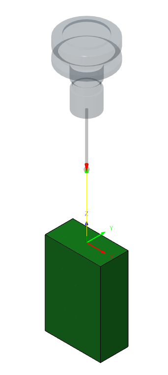

Put your master tool into the spindle and lower it untill it is just below the top edge of your reference artifact. 
Slowly raise the spindle till the artifact can just barely pass beneath the master tool (you should be in X1 mode on the MPG for this). 
Make careful note of where you do this calibration, so you'll be able to place the calibration artifact in the same place later when you want to recalibrate your probe offset --- for example if you change the probe tip. 

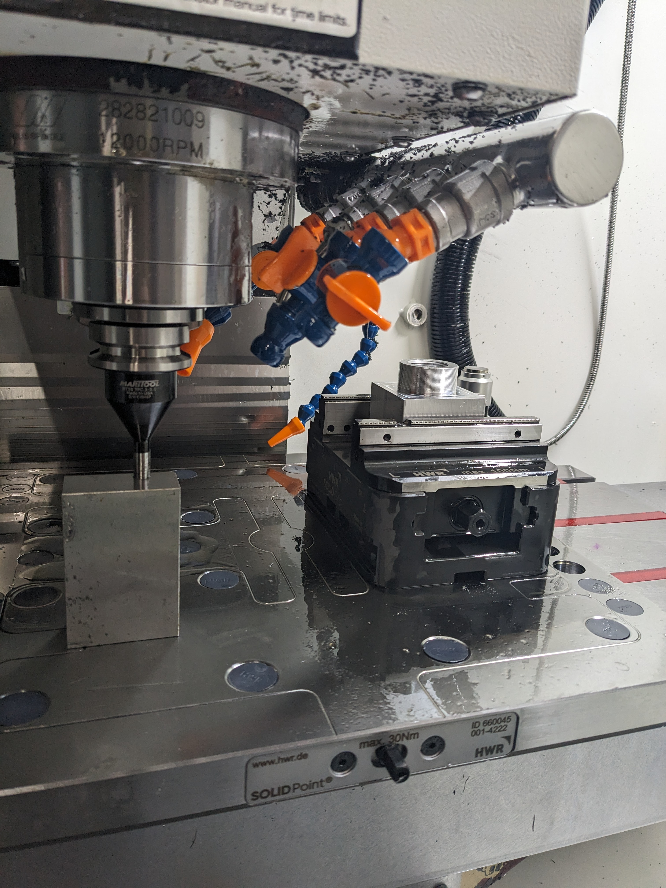

The macro will record the reference height of that artifact in the global variable @5109. 
It will also record the XY position into the extended work offset you configured in the `PROBECONFIG` macro (default is G54P99).
Then it will raise the spindle and ask you to do a manual tool change to the probe (i.e. remove the master gauge tool). 
Finally it will do a protected move down toward the artifact to calibrate the probe z offset and store it in the tool length of your perscribed probe tool number. 

### Quick Probe Z Height Calibration

Example MDI Command: G65 "CALIBRATEPROBEZ" A1

Once you have done the full calibration one time, 
you can use a quick version of the macro to recalibrate the probe offset without the need to use the master tool. 
But you must re-install your calibration artifact onto your table before calling this macro. 

This will move the table to the origin of the saved WCS (default is G54P99) and then do a protected move to calibrate the probe offset. 


### Probe Tip Diameter Calibration 

You can use one of the two provided calibration methods: 

	* `CALIBRATEPROBEBLOCK`
	* `CALIBRATEPROBERING`

#### CALIBRATEPROBEBLOCK

This macro uses a gauge block to calibrate the diameter of a probes ruby tip. 
It's important that the probe is concentric before beginning. 
Any good quality reference block artifact would be used, such as an actual gauge block or a high quality 123 block. 
If you are not using a calibrated reference artifact, you should use a well calibrated micrometer to measure your 123 block to get its true dimensions. 
123 blocks, even high quality ones, are commonly sold a few ten thousandths of an inch oversized to allow for lapping
and you want to put the true dimension into the macro arguments.
`A` is the gauge block's true X dimension
`B` is the gauge block's true Y dimension 
`C` is the amount of Z drop you want between your initial position and the measurement height. It needs to be a negative value.

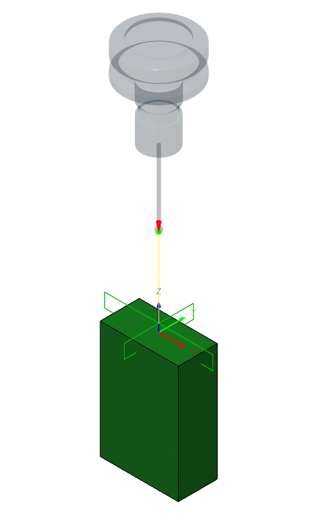

| GCode | "Macro Name" | Macro Argument | Macro Argument | Macro Argument |
| --- | --- | --- | --- | --- |
| G65 | "CALIBRATEPROBEBLOCK" | A | B | C |

_Table 2. Calibrate Probe X Syntax_

Example MDI Command: G65 "CALIBRATEPROBEBLOCK" A1.0002 B2.0001 C-0.5


#### CALIBRATEPROBERING

This macro uses a ring guage to calibrate the diameter of a probes ruby tip. 
It's important that the probe is concentric before beginning. 
`A`is the inside diameter of the ring guage. 
The probe must be inside of the guage and roughly centered. 
The routine will set the diameter of your probe tip and the radius can been seen in the tool table.

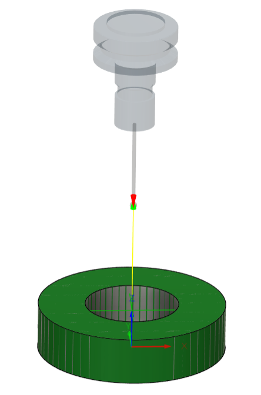

_Figure 3. Probe Diameter Calibration_


| G Code | "Macro Name" | Macro Argument | Macro Argument |
| --- | --- | --- | --- |
| G65 | "CALIBRATEPROBERING" | A |

_Table 4. Calibrate Probe Radius Syntax_

Example MDI Command: G65 "CALIBRATEPROBERING" A1.5

## Calibrating a toolsetter

Before you do any toolsetting, you need to tell the control where the toolsetter is. 

You should manually move your spindle to be located over the center of your toolsetter. 
You can do this by eye, using the MPG to drive the gauge tool till it looks centered. 
If you want a more precise location, 
you can use a dial indicator or coaxial indicator and sweep it around untill you are prefectly centered. 

Once you find your location, you will use the `TEACH IN` function in the offsets page to save that location as 
The origin for G54P100. 
The toolsetting location will be X0 Y0 in G54P100. 


### CALIBRATETOOLSET

This macro will use a master gauge tool to find the trigger height of your tool setter. 
Once you have set the G54P100 WCS to locate the tool setter, 
you can run this macro with the gauge tool in the spindle to calibrate the tool setter. 

The toolsetter trigger height will be saved to the tool height offset of tool 199.

| G Code | "Macro Name" | 
| --- | --- |
| G65 | "CALIBRATETOOLSET" |

Example MDI Command: G65 "CALIBRATETOOLSET"

## Probing Routines

### PROBEX

The Probe X macro probes the side of a part in the X direction. 
`A` is the selected work coordinate(G54-59). 
`B` is the distance to probe in X. 
`B` can be a positive or negative value depending on which side of the stock you would like to probe. 
If `B` is too small, the macro will report an error at the end of the routine.


_Figure 4. Probe X Routine_

| G Code | "Macro Name" | Macro Argument | Macro Argument |
| --- | --- | --- | --- |
| G65 | "PROBEX" | A | B |

_Table 5. Probe X Syntax_

Example MDI Command To Probe Right Side: G65 "PROBEX" A54 B-1

Example MDI Command To Probe Left Side: G65 "PROBEX" A54 B1

### PROBEY

The Probe Y macro probes the side of a part in the Y direction. 
`A` is the selected work coordinate(G54-59). 
`B` is the distance to probe in Y. 
`B` can be a positive or negative value depending on which side of the stock you would like to probe. 
If `B` is too small, the macro will report an error at the end of the routine.

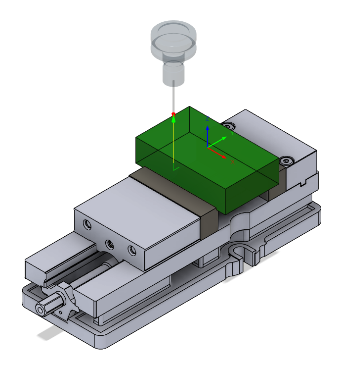

_Figure 5. Probe Y Routine_

| G Code | "Macro Name" | Macro Argument | Macro Argument |
| --- | --- | --- | --- |
| G65 | "PROBEY" | A | B |

_Table 6. Probe Y Syntax_

Example MDI Command To Probe the Front : G65 "PROBEY" A54.2 B1

Example MDI Command To Probe the Back  : G65 "PROBEY" A54.2 B-1


### PROBEZ

The Probe Z macro probes the top surface of a part in the negative Z direction. 
`A` is the selected work coordinate(G54-59). 
`B` is the distance to probe in Z and should be a negative value. 
`B` is too small or a positive value, the macro will report an error at the end of the routine.


_Figure 6. Probe Z Routine_

| G Code | "Macro Name" | Macro Argument | Macro Argument |
| --- | --- | --- | --- |
| G65 | "PROBEZ" | A | B |

_Table 7. Probe Z Syntax_

Example MDI Command: G65 "PROBEZ" A54 B-.5


### PROBEXWEB

The Probe X Web macro probes two sides of the stock in the X direction and calculates the center. 
`A` is the selected work coordinate(G54-59). 
`B` is the length of the stock. 
`C` is the distance the probe should move in Z below the edges of the stock. 
`Q` enables inspection reporting which pops up a calculated length after the routine finishes. 
The Probe should be roughly centered and above the stock before beginning.

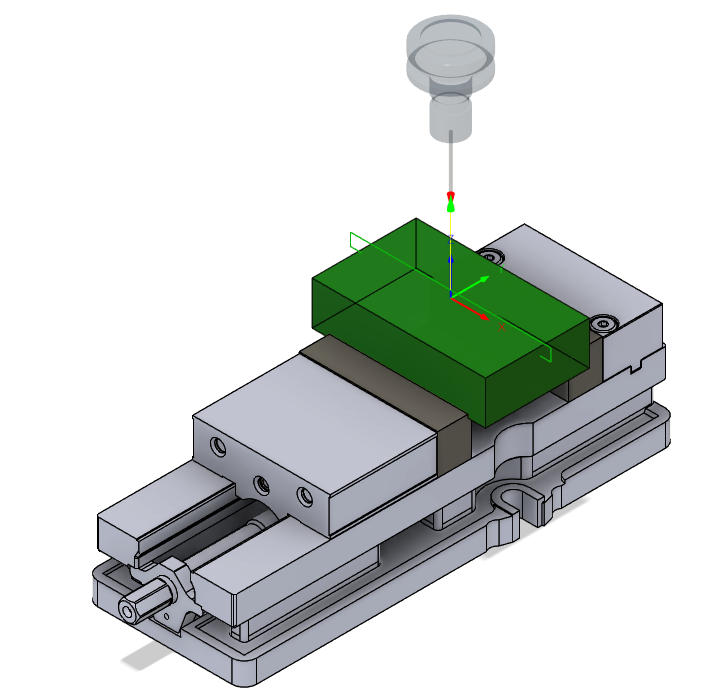

_Figure 7. Probe X Web Routine_

| GCode | "Macro Name" | Macro Argument | Macro Argument | Macro Argument | Macro Argument |
| --- | --- | --- | --- | --- | ---|
| G65 | "PROBEXWEB" | A | B | C | Q |

_Table 8. Probe X Web Syntax_

Example MDI Command Without Inspection Report: G65 "PROBEXWEB" A54 B3 C-.5 Q0

Example MDI Command With Inspection Report: G65 "PROBEXWEB" A54 B3 C-.5 Q1
  
### PROBEYWEB

The Probe Y Web macro probes two sides of the stock in the Y direction and calculates the center. 
`A` is the selected work coordinate(G54-59). 
`B` is the width of the stock. 
`C` is the distance the probe should move in Z below the edges of the stock.  
`Q` enables inspection reporting which pops up a calculated width after the routine finishes. 
The Probe should be roughly centered and above the stock before beginning.

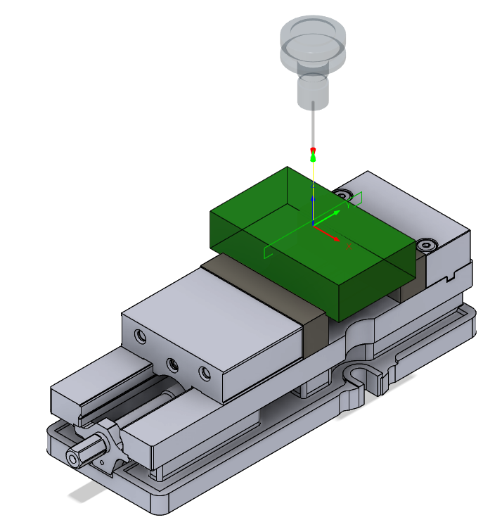

_Figure 8. Probe Y Web Routine_

| G Code | "Macro Name" | Macro Argument | Macro Argument | Macro Argument | Macro Argument |
| --- | --- | --- | --- | --- | --- |
| G65 | "PROBEYWEB" | A | B | C | Q |

_Table 9. Probe Y Web Syntax_

Example MDI Command Without Inspection Report: G65 "PROBEYWEB" A54 B2 C-.5 Q0

Example MDI Command With Inspection Report: G65 "PROBEYWEB" A54 B2 C-.5 Q1


### PROBECIRCULARBOSS

The Probe Circular Boss macro probes 4 points of a circular boss and calculates the center. 
`A` is the selected work coordinate(G54-59). 
`B` is the diameter of the stock. 
`C` is the distance the probe should move in Z below the edges of the stock.  
`D` turns on a second 
`Q` enables inspection reporting which pops up a calculated diameter after the routine finishes. The Probe should be roughly centered and above the stock before beginning.

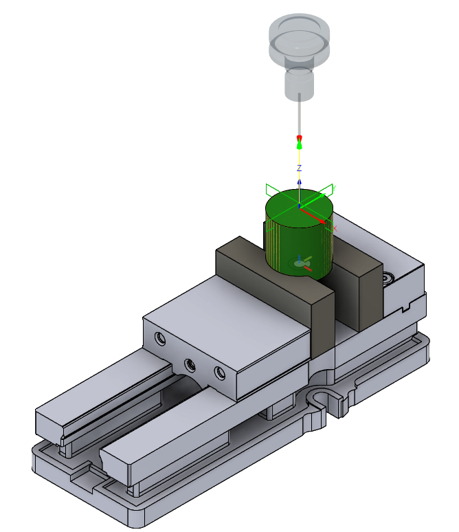

_Figure 9. Probe Circular Boss Routine_

| G Code | "Macro Name" | Macro Argument | Macro Argument | Macro Argument | Macro Argument |
| --- | --- | --- | --- | --- | --- |
| G65 | "PROBECIRCULARBOSS" | A | B | C | Q |

_Table 10. Probe Circular Boss Syntax_

Example MDI Command Without Inspection Report: G65 "PROBECIRCULARBOSS" A54 B2 C-.5 Q0

Example MDI Command With Inspection Report: G65 "PROBECIRCULARBOSS" A54 B2 C-.5 Q1
  
### PROBEBORE

The Probe Bore macro probes 4 points inside of a bore and calculates the center. 
`A` is the selected work coordinate(G54-59). 
`B` is the diameter of the bore. 
`Q` enables inspection reporting which pops up a calculated diameter after the routine finishes. 
The Probe should be roughly centered and inside of the bore before beginning.

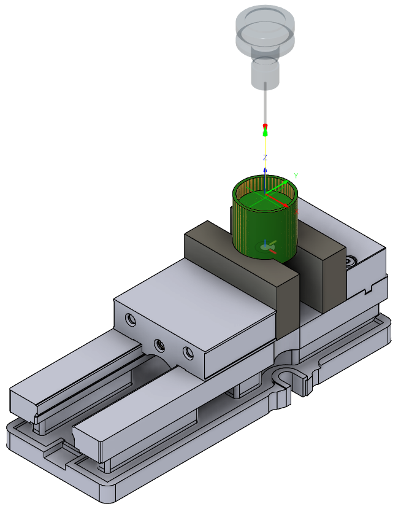

_Figure 10. Probe Bore Routine_

| G Code | "Macro Name" | Macro Argument | Macro Argument | Macro Argument |
| --- | --- | --- | --- | --- |
| G65 | "PROBEBORE" | A | B | Q |

_Table 11. Probe Bore Syntax_

Example MDI Command Without Inspection Reporting: G65 "PROBEBORE" A54 B1 Q0

Example MDI Command With Inspection Reporting: G65 "PROBEBORE" A54 B1 Q1

  
### PROBERECTANGULARBOSS

The Probe Rectangular Boss macro probes all sides of the stock and calculates the center. 
`A` is the selected work coordinate(G54-59). 
`B` is the length of the boss in X 
`C` is the width of the boss in Y. 
`D` is the distance the probe should move in Z below the edges of the bodd and should be a negative value. 
`Q` enables inspection reporting which pops up a calculated length and width after the routine finishes. 

The Probe should be roughly centered and above the stock before beginning.

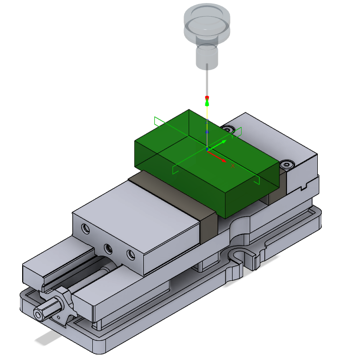

_Figure 11. Probe Rectangular Boss Routine_

| G Code | "Macro Name" | Macro Argument | Macro Argument | Macro Argument | Macro Argument | Macro Argument |
| --- | --- | --- | --- | --- | --- | --- |
| G65 | "PROBERECTANGULARBOSS" | A | B | C | D | Q |

_Table 12. Probe Rectangular Boss Syntax_

Example MDI Command Without Inspect Reporting: G65 "PROBERECTANGULARBOSS" A54 B3 C2 D-.5 Q0

Example MDI Command Without Inspect Reporting: G65 "PROBERECTANGULARBOSS" A54 B3 C2 D-.5 Q1


### PROBEPOCKET

The Probe Pocket macro probes all internal sides of a pocket and calculates the center. 
`A` is the selected work coordinate(G54-59). 
`B` is the length of the pocket in X
`C` is the width of the pocket in Y. 
`Q` enables inspection reporting which pops up a calculated length and width after the routine finishes. 

The Probe should be roughly centered and inside of the pocket before beginning.

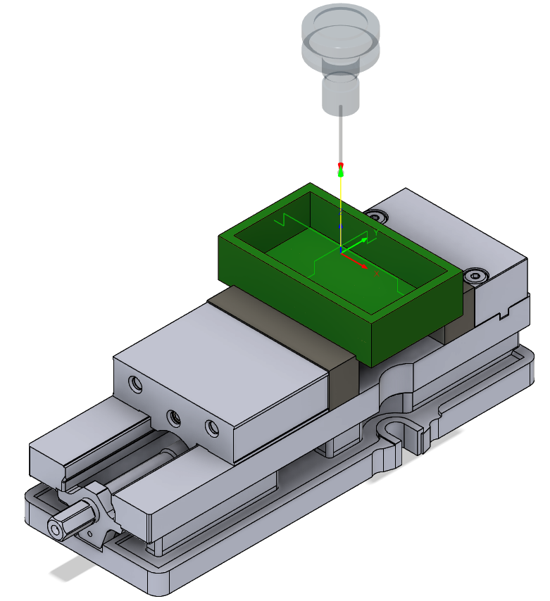

_Figure 12. Probe Pocket Routine_

| G Code | "Macro Name" | Macro Argument | Macro Argument | Macro Argument | Macro Argument |
| --- | --- | --- | --- | --- | --- |
| G65 | "PROBEPOCKET" | A | B | C | Q |

_Table 13. Probe Rectangular Pocket Syntax_

Example MDI Command Without Inspection Reporting: G65 "PROBERECTANGULARPOCKET" A54 B2 C3 Q0

Example MDI Command Without Inspection Reporting: G65 "PROBERECTANGULARPOCKET" A54 B2 C3 Q1

  
### PROBEXSLOT

The Probe Slot X macro probes the internal sides of a pocket in the X direction and calculates the center. 
`A` is the selected work coordinate(G54-59). 
`B` is the length of the pocket in X. 
`Q` enables inspection reporting which pops up a calculated length after the routine finishes. 
The Probe should be roughly centered and inside of the slot before beginning.

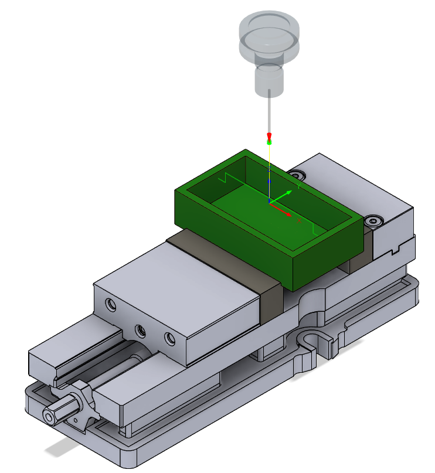

_Figure 13. Probe Slot Routine_

| G Code | "Macro Name" | Macro Argument | Macro Argument | Macro Argument |
| --- | --- | --- | --- | --- |
| G65 | "PROBESLOTX" | A | B | Q |

_Table 14. Probe Slot Syntax_

Example MDI Command Without Inspectioning: G65 "PROBESLOTX" A54 B3 Q0

Example MDI Command Without Inspectioning: G65 "PROBESLOTX" A54 B3 Q1
  
### PROBEYSLOT

The Probe Slot Y macro probes the internal sides of a pocket in the Y direction and calculates the center. 
`A` is the selected work coordinate(G54-59). 
`B` is the width of the pocket in Y. 
`Q` enables inspection reporting which pops up a calculated width after the routine finishes. 
The Probe should be roughly centered and inside of the slot before beginning.

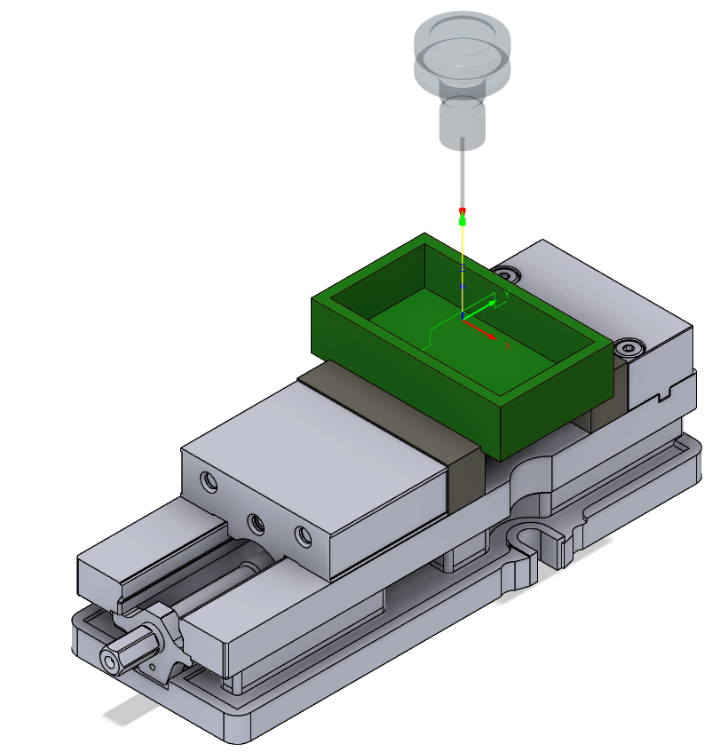

_Figure 14. Probe Slot Routine_

| G Code | "Macro Name" | Macro Argument | Macro Argument | Macro Argument |
| --- | --- | --- | --- | --- |
| G65 | "PROBESLOTY" | A | B | Q |

_Table 15. Probe Slot Syntax_

Example MDI Command Without Inspection Reporting: G65 "PROBESLOTY" A54 B3 Q0

Example MDI Command With Inspection Reporting: G65 "PROBESLOTY" A54 B3 Q1

  
### PROBEOUTSIDECORNER

The Probe Outside Corner macro probes the outside edges of the stock and calculates the center. 
`A`is the selected work coordinate(G54-59). 
`B` Selects the desired corner to probe. 
`C` is the distance to travel away from the inital location before probing begins. 
`D` is the probing distance for both X and Y. 
The Probe should be roughly centered, diagonaly from the corner befor beginning.


_Figure 15. Probe Outside Corner Routine_

| G Code | "Macro Name" | Macro Argument | Macro Argument | Macro Argument | Macro Argument |
| --- | --- | --- | --- | --- | --- |
| G65 | "PROBEOUTSIDECORNER" | A | B | C | D |

_Table 16. Probe Outer Corner Syntax_

Example MDI Command: G65 "PROBEOUTSIDECORNER" A54 B1 C1 D.5

  
### PROBEINSIDECORNER

The Probe inside Corner macro probes the inside edges of a pocket and calculates the center. 
`A` is the selected work coordinate(G54-59). 
`B` the desired corner to probe. 
`C` is the probing distance. 
The Probe should be roughly centered, diagonaly from the corner before beginning.

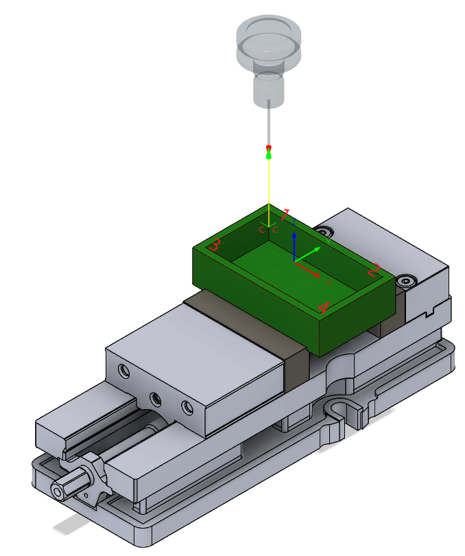

_Figure 16. Probe Inside Corner Routine_

| G Code | "Macro Name" | Macro Argument | Macro Argument | Macro Argument |
| --- | --- | --- | --- | --- |
| G65 | "PROBEINSIDECORNER" | A | B | C |

_Table 17. Probe Inner Corner Syntax_

Example MDI Command: G65 "PROBEINSIDECORNER" A54 B1 C.5

## SAFESPIN macro 

You might occationally command a spindle RPM speed from MDI. 
However, if you forget to comment/delete that RPM command before calling a probing routine ... 
wekk bad things happen when you spin probes real fast (especially if they are wired) :(

I could not find any kind of tool-number based RPM limits to ensure the probe never spins. 
Maybe I'm just missing it, but failing that I keep a bit in one of the wear values for the probe that flips to true whenever a probing routine is called. 
The `SAFESPIN` macro checks that bit before calling any spindle rotations commands, and gives a big flashy warning message to help you remember not to spin you probe. 

Why did I keep the bit in the wear table? I couldn't figure out where else to store it persistantly. I think there are some parameters memory locations I can get access to, but I haven't spent the time to figure out that syntax. 

## Tool Loading/Unloading Macros

These macros are for the 12 tool carousel ATC specifically, and if your controller has been updated to allow tool numbers higher than 12. 

	```
	I think that as of late 2023 LNC controllers shipped with the firmware that allows arbitrary tool numbers. 
	But older X7's did not, and required a firmware update that can be aquired by emailing the support team. 
	```

These macros allow you to add and remove tools without having to manually modify the tool table.
Use any tool number you want, up to 198.  
Tool number 199 is used to signify an empty pocket in the tool table. 

Both the load and unload macros set the tool gauge length to 999 and clear any tool wear compensation values. 
999 was chosen because its safe. If you don't toolset the tool before use, then you'll get a z-height error when you try to run. 

### LOADTOOL

| G Code | "Macro Name" | Macro Argument  |
| --- | --- | --- |
| G65 | "LOADTOOL" | T |

Example MDI Command: G65 "LOADTOOL" T10

There are three conditions considered: 

1) The tool number already exists in the tool table. 
In this case, call up that tool number and swap in the new tool. 

2) The tool number does not exist in the tool table, and there is an open tool pocket. 
In this case, assign the new tool to an empty pocket

3) The tool number does not exist in the tool table, but there is no empty tool pocket. 
In this case, prompt the user for which number tool they want to remove. 
Then re-assign that tool pocket to the new tool number.  

After you have loaded the tool, the macro will automatically run the `TOOLSET` macro to set the gauge length. 

### UNLOADTOOL

| G Code | "Macro Name" | Macro Argument  |
| --- | --- | --- |
| G65 | "UNLOADTOOL" | T |

Example MDI Command: G65 "UNLOAD" T10


## TODO

** Contributions Welcome! ** 

	- Add a `CHECKTOOL` macro that can look at the tool table and see if a tool number is present (would like to add this to the top of my postprocessor!)
	- Add a macro to check min/max values against soft-limits (would also like to add this to my post processor) 
	- Add probe runout compensation into the calibration: Rotate the spindle 180 degrees with M19P180. Then re-do calibration and compare results to compute runout. Need to figure out the math for how to compensate for it during probing. 
	- Add probe Angle routines (i.e. probe a wall and compute its angle, so you can rotate the X/Y axes)
	- Add 4th Axis probing routines
	- Add wear comp macros or wear comp to existing macros 


