**SYIL X7 LNC6800 Probing Macro Guide**

Smith Coding & Design

**Introduction**

The objective of this document is to provide guidance on the use of the provided open-source probing macros. The macros are meant to provide basic probing routines and support WCS probing within fusion360. They also serve as a reference for anyone interested in making their own custom macros. Community support and feedback is highly recommended, we are all in this together.

**Important Precautions**

The probing routines only support probes that don't require special macros to turn them on. Recommend probes included the drewtronics wireless probe or the Silver CNC Infrared Touch probe. All the macros need to be stored in the same file as your posted gcode programs. Always test the macros with MPG DRN the first time. SYIL configurates may change and we're not responsible for broken tips or machine crashes.

**Macro Syntax**

Macros are called with G65 as opposed to M codes to speed up execution. G65 is followed by the macro name and whatever arguments need passed into the macro. The example below shows how to probe a square. The A argument is the work offset and the B argument is the width. Each argument starts with a letter followed by a value. For example, a macro requiring three arguments would have A#, B# and C# after the macro name. Simply copy the macro into the MDI and adjust the arguments according to your needs. A table mapping the macro arguments to local variables is also provided below. Extended G54 work offsets are supported with the use of a decimal point. For example, G54P5 can be entered into the A argument as G54.5.

| G Code | "Macro Name" | Macro Argument | Macro Argument |
| --- | --- | --- | --- |
| G65 | "PROBESQUARE" | A | B |

_Table 1: Macro Syntax and Example_

Example MDI Command: G65 "PROBESQUARE" A54 B2

Example MDI Command: G65 "PROBESQUARE" A54.5 B2

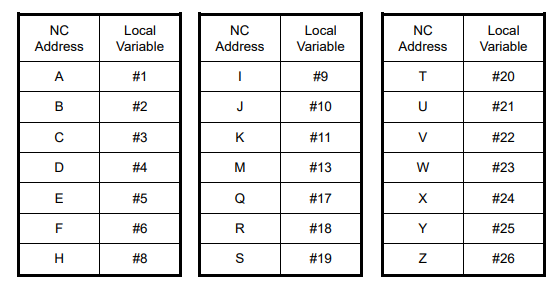

_Figure 1. Macro Argument to local variable mapping_

# Probe Calibration

**Basic Probe Setup**
Before performing any calibration routines your probe must be concentric. To make your probe concentric you must place a dial indicator on the ruby tip and rotate the probe in the spindle by hand. Adjust your probe until the dial indicator doesn't move or is within a few tenths. The height of your probe can be found using a tool setter if the force to trigger the tool setter is less than the probe. The Syil TTC-200 works with this method. If you don't have a tool setter, you can use a tool of known length and a 123 block. we recommend using a Maritool probe calibrator in this case. 

**CALIBRATEPROBEX**

| GCode | "Macro Name" | Macro Argument | Macro Argument |
| --- | --- | --- | --- |
| G65 | "CALIBRATEPROBEX" | A | B |

_Table 2. Calibrate Probe X Syntax_

**CALIBRATEPROBEY**

| G Code | "Macro Name" | Macro Argument | Macro Argument |
| --- | --- | --- | --- |
| G65 | "CALIBRATEPROBEY" | A | B |

_Table 3. Calibrate Probe Y Syntax_

**CALIBRATEPROBERADIUS**

| G Code | "Macro Name" | Macro Argument | Macro Argument |
| --- | --- | --- | --- |
| G65 | "CALIBRATEPROBERADIUS" | A | B |

_Table 4. Calibrate Probe Radius Syntax_

# Probing Routines

**PROBEX**

The Probe X macro probes the side of a part in the X direction. The A argument is the selected work coordinate(G54-59). The B argument is the distance to probe in X. The X distance can be a positive or negative value depending on which side of the stock you would like to probe. If the X distance is too small, the macro will report an error at the end of the routine.

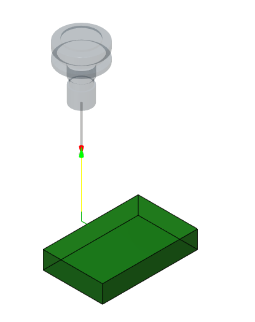

_Figure 2. Probe X Routine_

| G Code | "Macro Name" | Macro Argument | Macro Argument |
| --- | --- | --- | --- |
| G65 | "PROBEX" | A | B |

_Table 5. Probe X Syntax_

Example MDI Command To Probe Right Side: G65 "PROBEX" A54 B-1
Example MDI Command To Probe Left Side: G65 "PROBEX" A54 B1

**PROBEY**

The Probe Y macro probes the side of a part in the Y direction. The A argument is the selected work coordinate(G54-59). The B argument is the distance to probe in Y. The Y distance can be a positive or negative value depending on which side of the stock you would like to probe. If Y distance is too small, the macro will report an error at the end of the routine.

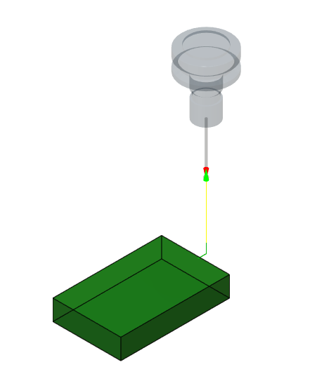

_Figure 3. Probe Y Routine_

| G Code | "Macro Name" | Macro Argument | Macro Argument |
| --- | --- | --- | --- |
| G65 | "PROBEY" | A | B |

_Table 6. Probe Y Syntax_

Example MDI Command To Probe the Front : G65 "PROBEY" A54 B1
Example MDI Command To Probe the Back  : G65 "PROBEY" A54 B-1

**PROBEZ**

The Probe Z macro probes the top surface of a part in the negative Z direction. The A argument is the selected work coordinate(G54-59). The B argument is the distance to probe in Z and should be a negative value. If the Z distance is too small or a positive value, the macro will report an error at the end of the routine.

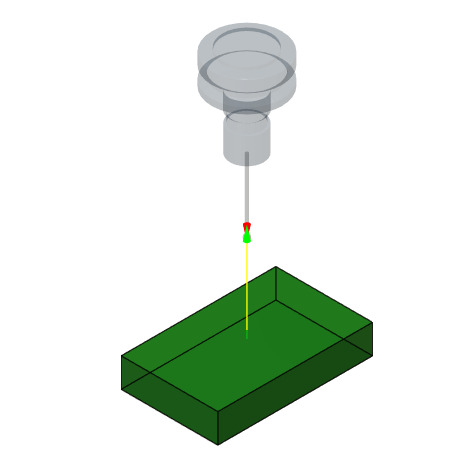

_Figure 4. Probe Z Routine_

| G Code | "Macro Name" | Macro Argument | Macro Argument |
| --- | --- | --- | --- |
| G65 | "PROBEZ" | A | B |

_Table 7. Probe Z Syntax_

Example MDI Command: G65 "PROBEZ" A54 B-.5

**PROBEXWEB**

The Probe X Web macro probes two sides of the stock in the X direction and calculates the center. The A argument is the selected work coordinate(G54-59). The B argument is the distance the probe should move in Z below the edges of the stock and should be a negative value. The C argument is the length of the stock. The Probe should be roughly centered and above the stock before beginning.

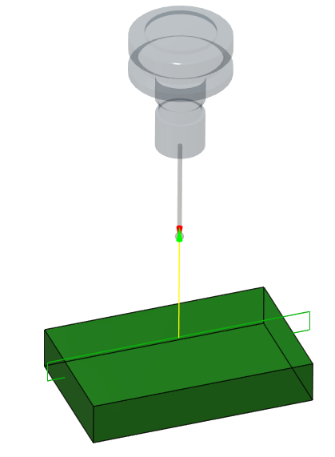

_Figure 5. Probe X Web Routine_

| GCode | "Macro Name" | Macro Argument | Macro Argument | Macro Argument |
| --- | --- | --- | --- | --- |
| G65 | "PROBEXWEB" | A | B | C |

_Table 8. Probe X Web Syntax_

Example MDI Command: G65 "PROBEXWEB" A54 B-.5 C3

  
**PROBEYWEB**

The Probe Y Web macro probes two sides of the stock in the Y direction and calculates the center. The A argument is the selected work coordinate(G54-59). The B argument is the distance the probe should move in Z below the edges of the stock and should be a negative value. The C argument is the width of the stock. The Probe should be roughly centered and above the stock before beginning.

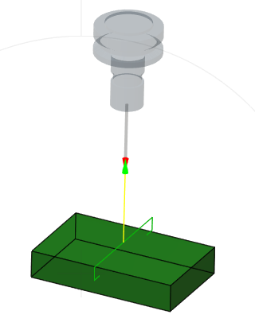

_Figure 6. Probe Y Web Routine_

| G Code | "Macro Name" | Macro Argument | Macro Argument | Macro Argument |
| --- | --- | --- | --- | --- |
| G65 | "PROBEYWEB" | A | B | C |

_Table 9. Probe Y Web Syntax_

Example MDI Command: G65 "PROBEYWEB" A54 B-.5 C2

**PROBECIRCULARBOSS**

The Probe Circular Boss macro probes 4 points of a circular boss and calculates the center. The A argument is the selected work coordinate(G54-59). The B argument is the distance the probe should move in Z below the edges of the stock and should be a negative value. The C argument is the diameter of the stock. The Probe should be roughly centered and above the stock before beginning.

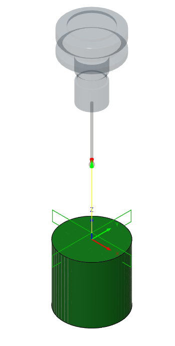

_Figure 7. Probe Circular Boss Routine_

| G Code | "Macro Name" | Macro Argument | Macro Argument | Macro Argument |
| --- | --- | --- | --- | --- |
| G65 | "PROBECIRCULARBOSS" | A | B | C |

_Table 10. Probe Circular Boss Syntax_

Example MDI Command: G65 "PROBECIRCULARBOSS" A54 B-.5 C2

  
**PROBEBORE**

The Probe Bore macro probes 4 points inside of a bore and calculates the center. The A argument is the selected work coordinate(G54-59). The B argument is the distance the probe should move in Z below the edges of the stock and should be a negative value. The C argument is the diameter of the bore. The Probe should be roughly centered and above the bore before beginning.

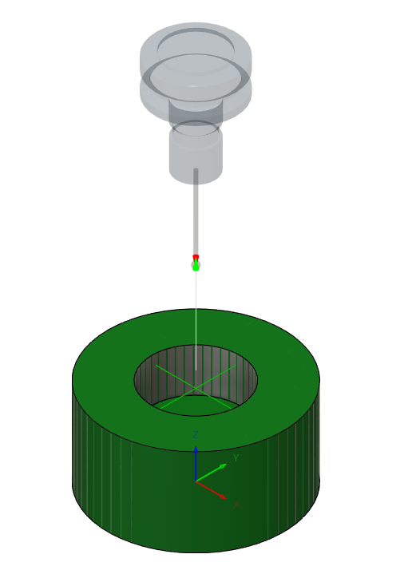

_Figure 8. Probe Bore Routine_

| G Code | "Macro Name" | Macro Argument | Macro Argument | Macro Argument |
| --- | --- | --- | --- | --- |
| G65 | "PROBEBORE" | A | B | C |

_Table 11. Probe Bore Syntax_

Example MDI Command: G65 "PROBEBORE" A54 B-.5 C1

  
**PROBERECTANGULARBOSS**

The Probe Rectangular Boss macro probes all sides of the stock and calculates the center. The A argument is the selected work coordinate(G54-59). The B argument is the distance the probe should move in Z below the edges of the stock and should be a negative value. The C argument is the length of the stock in X and the D argument is the width of the stock in Y. The Probe should be roughly centered and above the stock before beginning.

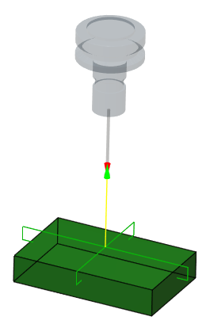

_Figure 9. Probe Rectangular Boss Routine_

| G Code | "Macro Name" | Macro Argument | Macro Argument | Macro Argument | Macro Argument |
| --- | --- | --- | --- | --- | --- |
| G65 | "PROBERECTANGULARBOSS" | A | B | C | D |

_Table 12. Probe Rectangular Boss Syntax_

Example MDI Command: G65 "PROBERECTANGULARBOSS" A54 B-.5 C3 D2

  
**PROBERECTANGULARPOCKET**

The Probe Rectangular Pocket macro probes all internal sides of a pocket and calculates the center. The A argument is the selected work coordinate(G54-59). The B argument is the distance the probe should move in Z below the edges of the stock and should be a negative value. The C argument is the length of the pocket in X and the D argument is the width of the pocket in Y. The Probe should be roughly centered and above the pocket before beginning.

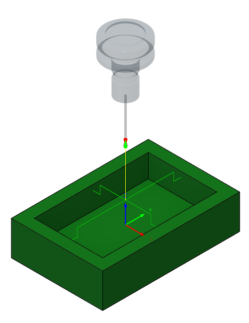

_Figure 10. Probe Rectangular Pocket Routine_

| G Code | "Macro Name" | Macro Argument | Macro Argument | Macro Argument | Macro Argument |
| --- | --- | --- | --- | --- | --- |
| G65 | "PROBERECTANGULARPOCKET" | A | B | C | D |

_Table 13. Probe Rectangular Pocket Syntax_

Example MDI Command: G65 "PROBERECTANGULARPOCKET" A54 B-.5 C3 D2

  
**PROBESLOTX**

The Probe Slot X macro probes the internal sides of a pocket in the X direction and calculates the center. The A argument is the selected work coordinate(G54-59). The B argument is the distance the probe should move in Z below the edges of the stock and should be a negative value. The C argument is the length of the pocket in X. The Probe should be roughly centered and above the pocket before beginning.

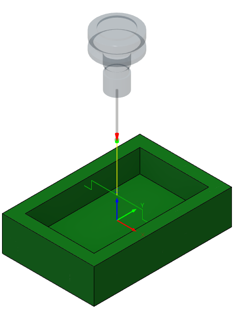

_Figure 11. Probe Slot Routine_

| G Code | "Macro Name" | Macro Argument | Macro Argument | Macro Argument |
| --- | --- | --- | --- | --- |
| G65 | "PROBESLOTX" | A | B | C |

_Table 14. Probe Slot Syntax_

Example MDI Command: G65 "PROBESLOTX" A54 B-.5 C3

  
**PROBESLOTY**

The Probe Slot Y macro probes the internal sides of a pocket in the Y direction and calculates the center. The A argument is the selected work coordinate(G54-59). The B argument is the distance the probe should move in Z below the edges of the stock and should be a negative value. The C argument is the width of the pocket in Y. The Probe should be roughly centered and above the pocket before beginning.

_Figure 11. Probe Slot Routine_

| G Code | "Macro Name" | Macro Argument | Macro Argument | Macro Argument |
| --- | --- | --- | --- | --- |
| G65 | "PROBESLOTY" | A | B | C |

_Table 15. Probe Slot Syntax_

Example MDI Command: G65 "PROBESLOTY" A54 B-.5 C3

  
**PROBEOUTSIDECORNER**

The Probe Outside Corner macro probes the outside edges of the stock and calculates the center. The A argument is the selected work coordinate(G54-59). The B argument is the distance the probe should move in Z below the edges of the stock and should be a negative value. The C argument is the distance to travel before probing begins. The D argument is the probing distance for both X and Y. The Probe should be roughly centered, above and in front of the corner before beginning.

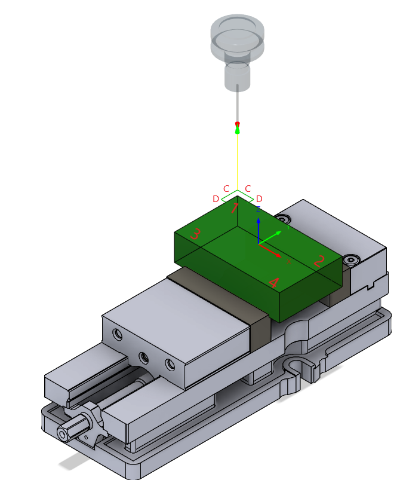

_Figure 12. Probe Outside Corner Routine_

| G Code | "Macro Name" | Macro Argument | Macro Argument | Macro Argument | Macro Argument |
| --- | --- | --- | --- | --- | --- |
| G65 | "PROBEOUTSIDECORNER" | A | B | C | D |

_Table 16. Probe Outer Corner Syntax_

Example MDI Command: G65 "PROBEOUTSIDECORNER" A54 B-.5 C1 D.5

  
**PROBEINSIDECORNER**

The Probe inside Corner macro probes the inside edges of a pocket and calculates the center. The A argument is the selected work coordinate(G54-59). The B argument is the distance the probe should move in Z below the edges of the stock and should be a negative value. The C argument is the probing distance. The Probe should be roughly centered, above and behind the corner before beginning.

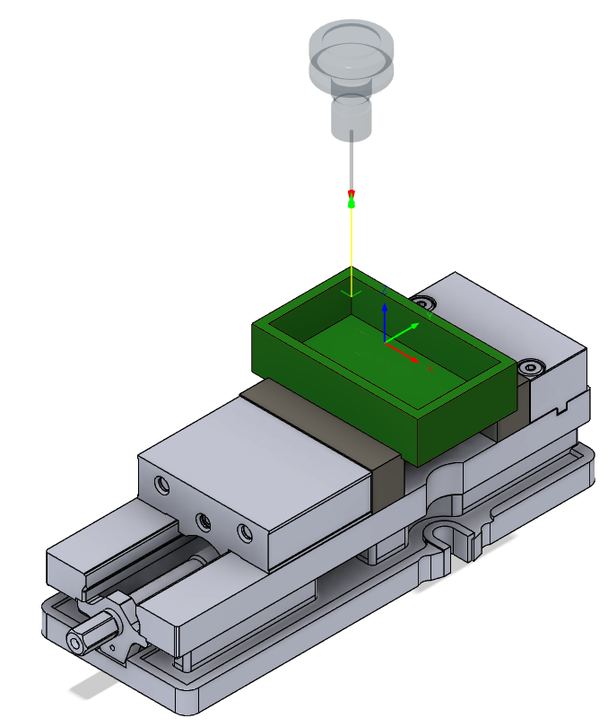

_Figure 13. Probe Inside Corner Routine_

| G Code | "Macro Name" | Macro Argument | Macro Argument | Macro Argument |
| --- | --- | --- | --- | --- |
| G65 | "PROBEINSIDECORNER" | A | B | C |

_Table 17. Probe Inner Corner Syntax_

Example MDI Command: G65 "PROBEINSIDECORNER" A54 B-.5 C.5

